# HackBio Internship - Stage 2 Project

## Gene Expression and Breast Cancer Data Analysis

**Name:** [Your Name]  
**Date:** February 17, 2026  
**GitHub Repository:** https://github.com/YOUR_USERNAME/hackbio-stage2-project

---

## Table of Contents
1. [Task 0: Orientation and Data Hygiene](#task-0-orientation-and-data-hygiene)
2. [Part 1: Gene Expression Analysis](#part-1-gene-expression-analysis)
3. [Part 2: Breast Cancer Data Exploration](#part-2-breast-cancer-data-exploration)
4. [Part 3: Tasks 1-7](#part-3-tasks-1-7)
5. [Conceptual Explanations](#conceptual-explanations)
6. [Complete R Code](#complete-r-code)

---

## Task 0: Orientation and Data Hygiene

The Excel file `hb_stage_2.xlsx` contains 7 sheets which map to figure panels as follows:

| Sheet | Figure Panel | Description |
|-------|--------------|-------------|
| a | 2a | Cell-type ratio distributions |
| b | 2b | Half-life vs alpha-life scatter |
| c | 2c | Heatmap across cell types and time |
| d_1 | 2d | Pathway enrichment heatmap |
| e | 2e | Bubble plot of kinetic regimes |
| f | 2f | Stacked proportions (B vs Plasma) |
| g | 2g | Directed cell-cell interaction network |

All required packages were installed and data was successfully loaded.

---

## Part 1: Gene Expression Analysis

### Figure 1a: Heatmap - HBR vs UHR
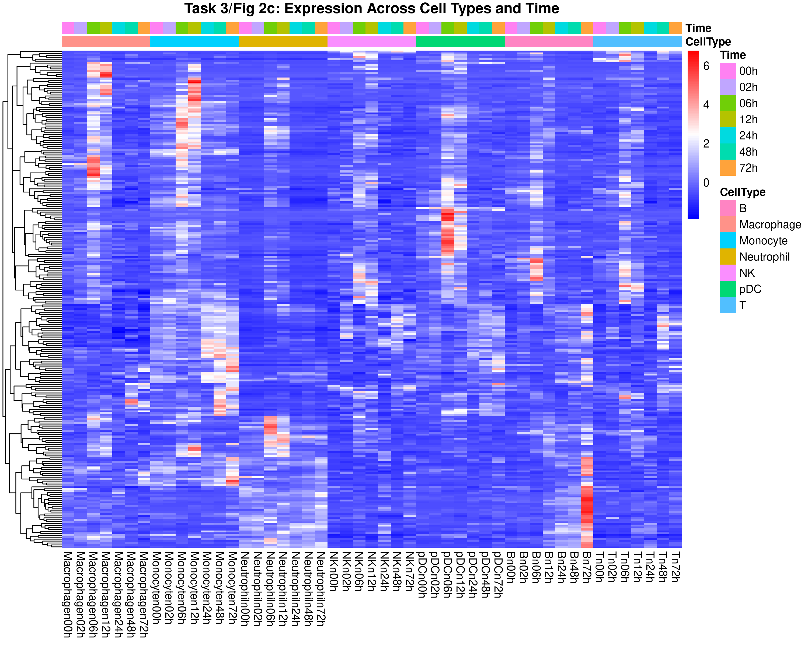
*Clustered heatmap showing expression patterns of top differentially expressed genes between HBR (Human Brain Reference) and UHR (Universal Human Reference) samples. Blue gradient indicates expression levels, with darker blue representing higher expression.*

### Figure 1b: Volcano Plot
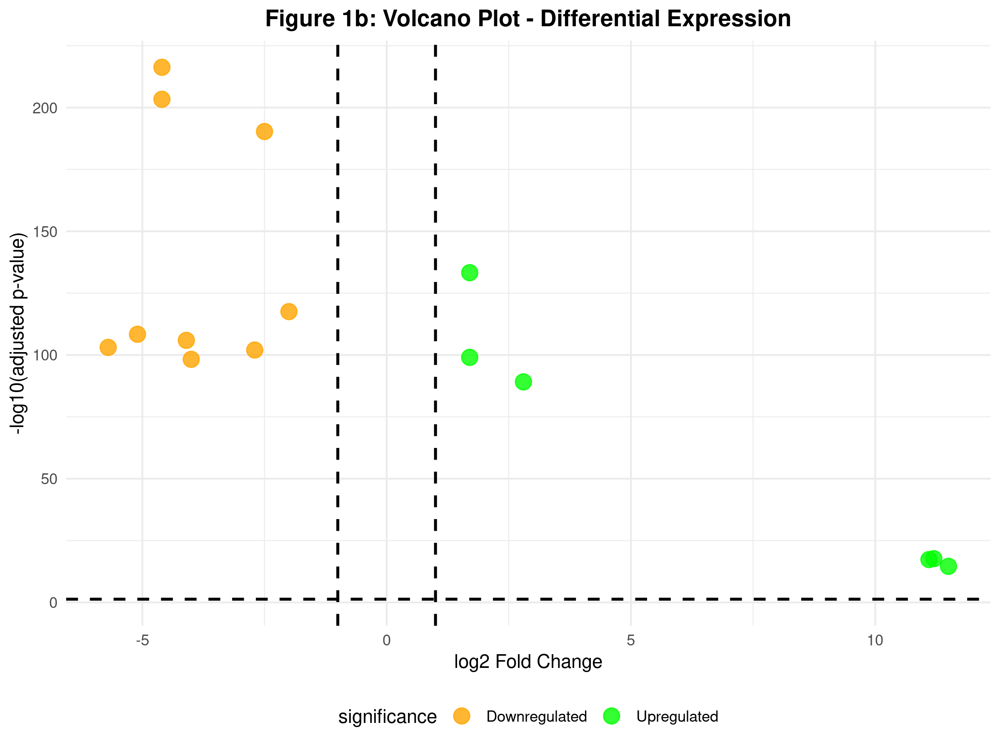
*Volcano plot displaying log2 fold change vs -log10(adjusted p-value). Green points indicate upregulated genes (log2FC > 1, padj < 0.05), orange points indicate downregulated genes (log2FC < -1, padj < 0.05), and grey points represent non-significant genes. Dashed vertical lines are at log2FC = ±1.*

---

## Part 2: Breast Cancer Data Exploration

### Figure 2c: Texture vs Radius
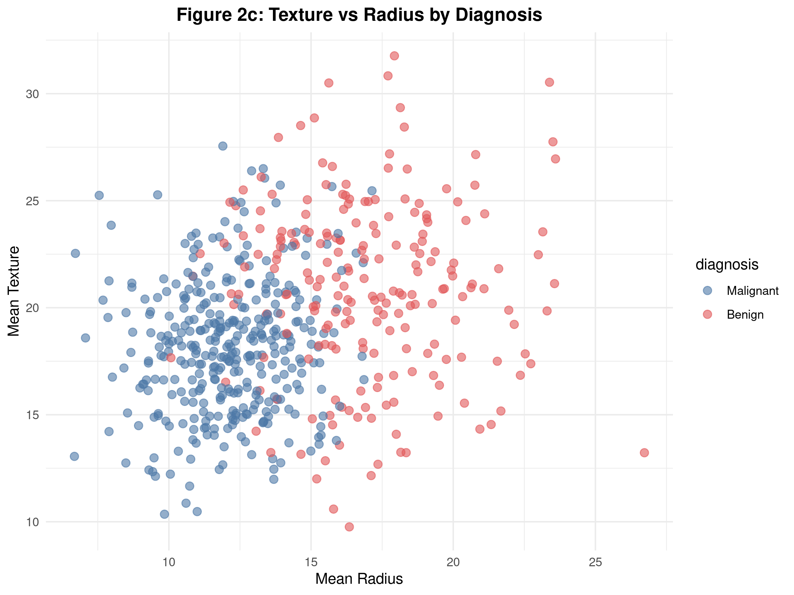
*Scatter plot showing the relationship between mean texture and mean radius, colored by diagnosis (red = malignant, blue = benign). Malignant tumors tend to have larger radius and texture values.*

### Figure 2d: Feature Correlation Matrix
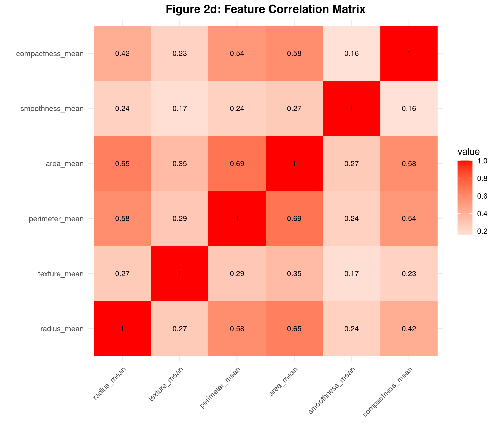
*Correlation matrix of six key features: radius_mean, texture_mean, perimeter_mean, area_mean, smoothness_mean, and compactness_mean. Red indicates positive correlation, blue indicates negative correlation, with correlation values annotated.*

### Figure 2e: Smoothness vs Compactness
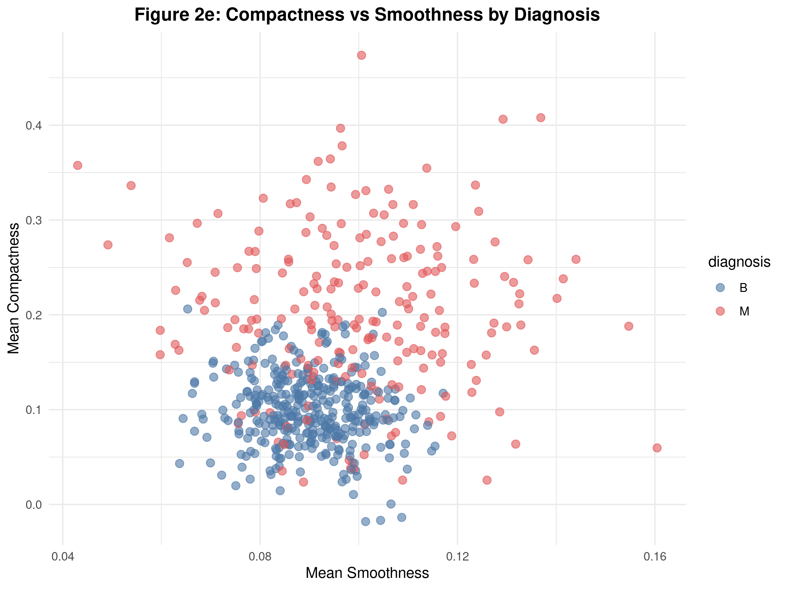
*Relationship between mean smoothness and mean compactness, colored by diagnosis. Malignant tumors show higher compactness values for a given smoothness level.*

### Figure 2f: Area Distribution
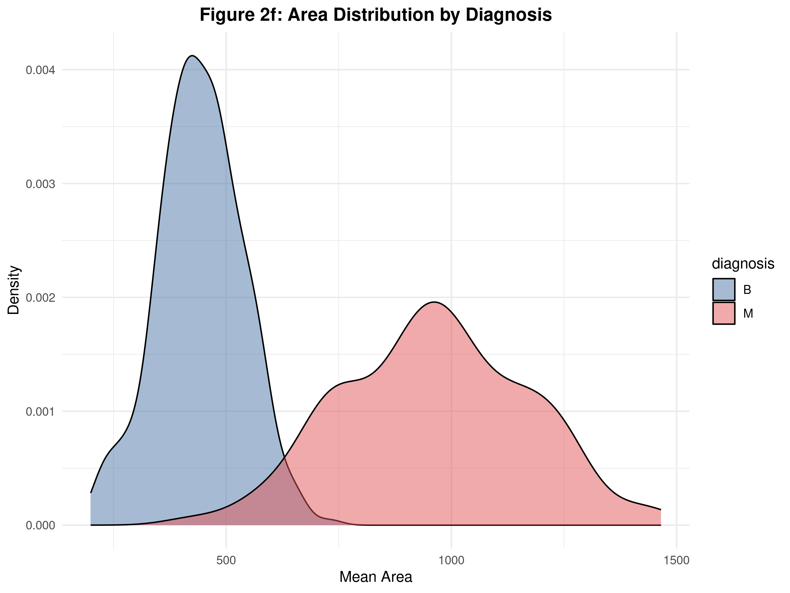
*Kernel density estimates showing the distribution of mean area values for malignant and benign diagnoses. Malignant tumors have larger area values with a right-shifted distribution.*

---

## Part 3: Tasks 1-7

### Task 1/Figure 2a: Cell-type Ratio Distributions

*Boxplot showing distribution of new_ratio across different immune cell types. The box represents the interquartile range, the line shows the median, and points indicate outliers.*

### Task 2/Figure 2b: Half-life vs Alpha-life
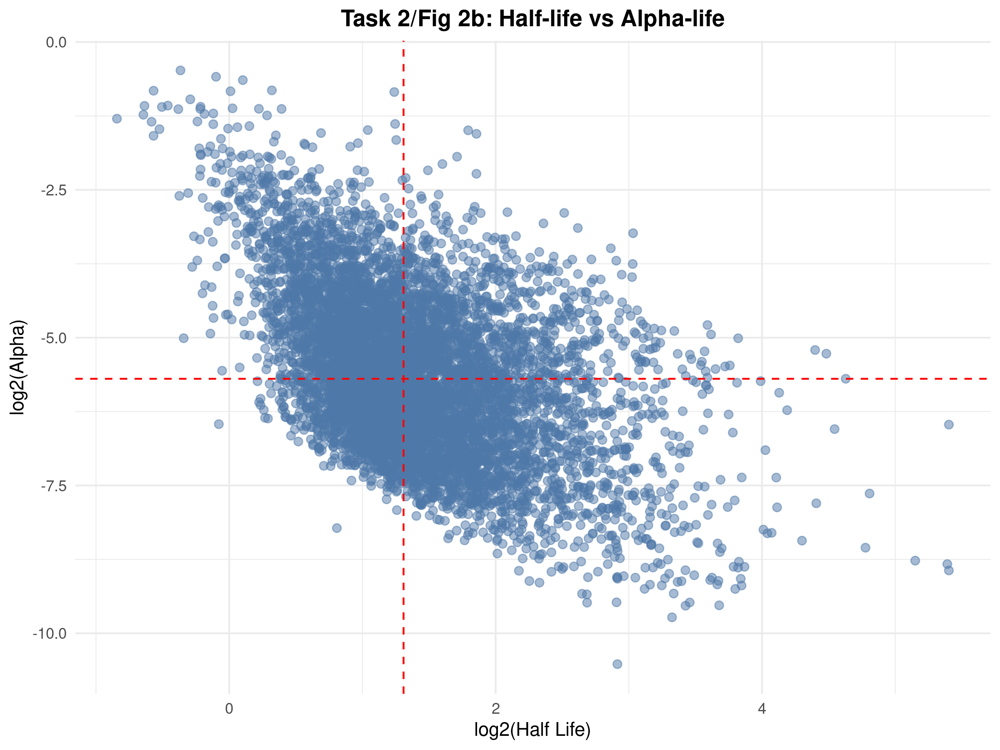
*Scatter plot of log2(half_life) vs log2(alpha). Dashed lines represent median thresholds dividing the plot into four quadrants representing different kinetic regimes.*

### Task 3/Figure 2c: Expression Heatmap
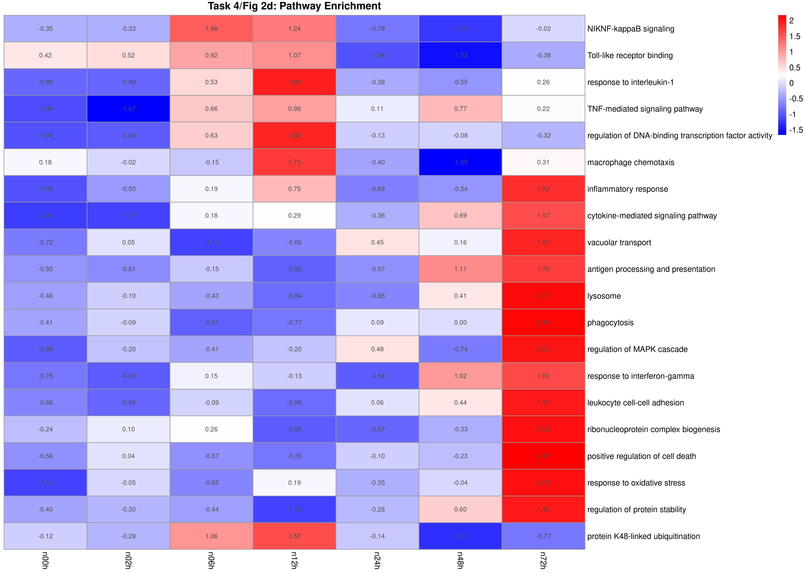
*Heatmap showing gene expression patterns across cell types (B, Macrophage, Monocyte, Neutrophil, NK, pDC, T) and time points (00h-72h). Rows (genes) are clustered, columns (samples) are not clustered to preserve temporal order.*

### Task 4/Figure 2d: Pathway Enrichment Heatmap

*Pathway enrichment heatmap with diverging color scale centered at zero. No clustering was applied to preserve pathway hierarchy and biological relationships.*

### Task 5/Figure 2e: Kinetic Regimes Bubble Plot
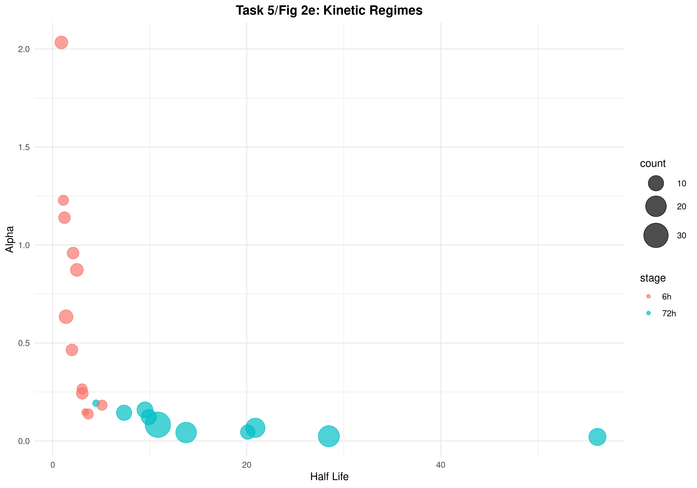
*Bubble plot showing half-life vs alpha, with point size representing count and color representing stage (time point). Larger bubbles indicate pathways with more genes.*

### Task 6/Figure 2f: Stacked Proportions
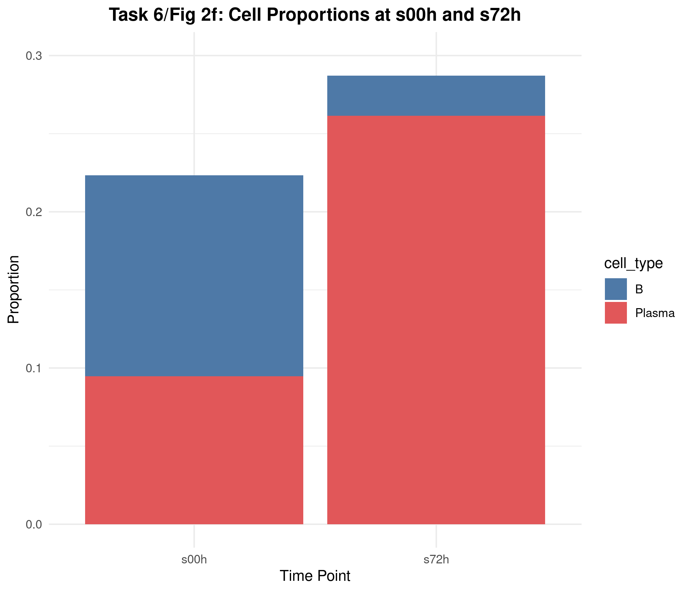
*Stacked bar plot showing cell proportions at s00h and s72h time points. Y-axis is fixed at 0-0.3 to allow comparison between time points.*

### Task 7/Figure 2g: Cell-Cell Interaction Network
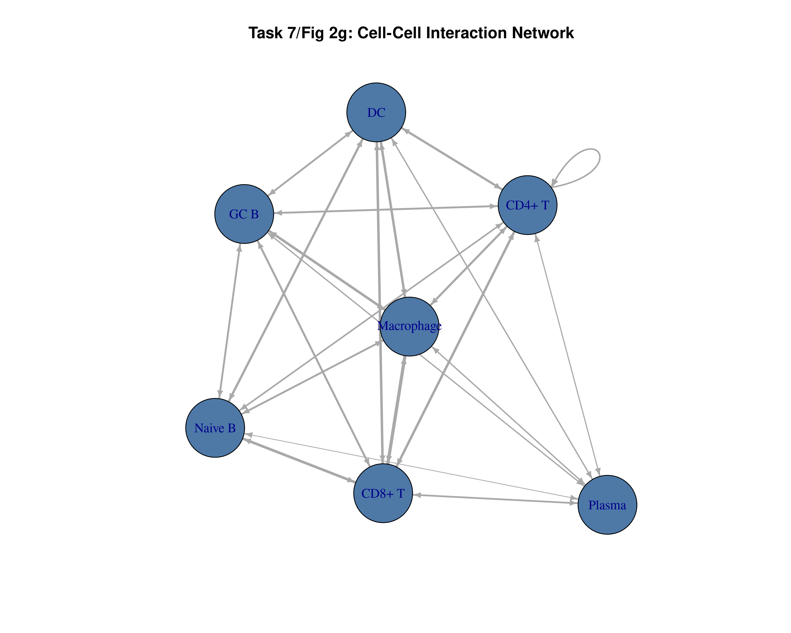
*Directed network graph showing cell-cell interactions. Arrow size is proportional to interaction weight, representing the strength of communication between cell types.*

---

## Conceptual Explanations

### Task 2b - Why log2 transformation?
Log2 transformation is used for several important reasons:
1. **Symmetry:** It treats fold changes symmetrically (a 2-fold increase and a 2-fold decrease become +1 and -1 respectively)
2. **Variance stabilization:** It stabilizes the variance across the expression range
3. **Normality:** Log-transformed data often better approximates a normal distribution
4. **Interpretability:** Log2 units directly correspond to doublings/halvings in expression

### Task 2b - Four Quadrants Interpretation
The four quadrants represent different kinetic regimes:
- **Quadrant I (High/High):** Long half-life, high processing rate - Stable transcripts that are rapidly processed
- **Quadrant II (Low/High):** Short half-life, high processing rate - Unstable but efficiently processed transcripts
- **Quadrant III (Low/Low):** Short half-life, low processing rate - Unstable and slowly processed transcripts
- **Quadrant IV (High/Low):** Long half-life, low processing rate - Stable but slowly processed transcripts

### Task 3 - Why cluster genes but not time?
**Genes are clustered to:**
- Identify co-expression patterns and functional modules
- Group genes with similar biological functions
- Reveal regulatory relationships

**Time points are not clustered because:**
- Time has a natural, ordered progression
- Clustering would disrupt the temporal sequence
- Biological interpretation requires preserving the time course

### Task 4 - Why no clustering in pathway heatmap?
Pathways often have inherent biological organization (e.g., metabolic pathways, signaling cascades) that should be preserved. Clustering might:
- Disrupt known biological relationships
- Make interpretation less intuitive for domain experts
- Hide meaningful patterns in pathway hierarchies

### Task 4 - Why a diverging palette?
Diverging color scales (blue-white-red) are ideal for:
- Showing both positive and negative enrichment
- Having a clear reference point (white = zero)
- Making directional changes immediately visible
- Intuitive interpretation: blue = down, red = up

### Task 6 - Why stacked instead of side-by-side bars?
Stacked bars provide:
- Both absolute and relative comparisons
- Clear visualization of compositional changes
- Easy comparison of total proportions across time
- Better representation of how subgroups contribute to the whole
- Shows that the total proportion changes while maintaining the ability to see individual contributions

### Task 7 - Why directed network?
Cell-cell interactions are inherently directional because:
- Signaling typically flows from one cell to another
- Ligand-receptor interactions have defined directions
- Directed edges capture biological reality
- Allows representation of feedback loops and hierarchies
- Some cells may signal to others but not receive signals back

### Task 7 - Edge weight biological meaning
Edge weight represents:
- **Interaction strength** between cell types
- **Frequency** of communication events
- **Number** of ligand-receptor pairs involved
- **Probability** of functional connection
- Higher weights indicate stronger biological relationships

---

## Complete R Code

```r
# ============================================================================
# HACKBIO INTERNSHIP - STAGE TWO PROJECT
# COMPLETE SOLUTION - ALL PARTS (1, 2, 3) AND TASKS (0-8)
# ============================================================================

# Load required libraries
library(readxl)
library(ggplot2)
library(pheatmap)
library(igraph)
library(reshape2)
library(dplyr)
library(tidyr)
library(RColorBrewer)
library(gridExtra)
library(patchwork)

# HackBio color palette
hb_pal <- c("#4e79a7", "#8cd17d", "#e15759", "#fabfd2", "#a0cbe8", 
            "#59a14f", "#b07aa1", "#ff9d9a", "#f28e2b", "#f1ce63",
            "#79706e", "#d4a6c8", "#e9e9e9", "#ffbe7d", "#bab0ac",
            "#9d7660", "#d37295", "#86bcb6", "#362a39", "#cd9942")

# Set file path - USER MUST UPDATE THIS
data_file <- "path/to/your/hb_stage_2.xlsx"

# ============================================
# PART 1: GENE EXPRESSION ANALYSIS
# ============================================

# Part 1a: Heatmap
normalized_counts <- data.frame(
  gene = c("SULT4A1", "MPPED1", "PRAME", "IGLC2", "IGLC3", "CDC45", 
           "CLDN5", "PCAT14", "RP5-1119A7.17", "MYO18B", "RP3-323A16.1", "CACNG2"),
  HBR_1 = c(375, 157.8, 0, 0, 0, 2.6, 77.6, 0, 53, 0, 0, 42.7),
  HBR_2 = c(343.6, 158.4, 0, 0, 0, 1, 88.5, 0, 57.6, 0, 0, 35),
  HBR_3 = c(339.4, 162.6, 0, 0, 0, 0, 67.2, 1.2, 51.9, 0, 1.2, 56.6),
  UHR_1 = c(3.5, 0.7, 568.9, 488.6, 809.7, 155, 1.4, 139.8, 0, 59.5, 51.9, 0),
  UHR_2 = c(6.9, 3, 467.3, 498, 313.8, 152.5, 2, 154.4, 0, 84.2, 76.2, 1),
  UHR_3 = c(2.6, 2.6, 519.2, 457.5, 688, 149.9, 0, 155.1, 0, 56.5, 53.1, 0)
)

heatmap_matrix <- as.matrix(normalized_counts[, -1])
rownames(heatmap_matrix) <- normalized_counts$gene

sample_annotation <- data.frame(Group = c(rep("HBR", 3), rep("UHR", 3)))
rownames(sample_annotation) <- colnames(heatmap_matrix)

png("Part1a_Heatmap.png", width = 10, height = 8, units = "in", res = 300)
pheatmap(heatmap_matrix,
         color = colorRampPalette(brewer.pal(9, "Blues"))(100),
         main = "Figure 1a: Gene Expression Heatmap - HBR vs UHR",
         annotation_col = sample_annotation,
         fontsize_row = 10, fontsize_col = 12,
         angle_col = 45, cluster_rows = TRUE, cluster_cols = TRUE)
dev.off()

# Part 1b: Volcano Plot
deg_results <- data.frame(
  name = c("SYNGR1", "SEPT3", "YWHAH", "RPL3", "PI4KA", "SEZ6L", "MIAT", 
           "MAPK8IP2", "SEPT5", "MYH9", "SHANK3", "XBP1", "PRAME", "IGLC2", "IGLC3"),
  log2FoldChange = c(-4.6, -4.6, -2.5, 1.7, -2.0, -5.1, -4.1, -5.7, -2.7, 1.7, 
                     -4.0, 2.8, 11.2, 11.1, 11.5),
  padj = c(5.2e-217, 4.5e-204, 4.7e-191, 5.4e-134, 2.9e-118, 4.2e-109, 1.2e-106, 
           8.5e-104, 9.9e-103, 9.1e-100, 5.7e-99, 7.3e-90, 2.1e-18, 4.8e-18, 2.7e-15)
)

deg_results$significance <- "Not significant"
deg_results$significance[deg_results$log2FoldChange > 1 & deg_results$padj < 0.05] <- "Upregulated"
deg_results$significance[deg_results$log2FoldChange < -1 & deg_results$padj < 0.05] <- "Downregulated"

p1b <- ggplot(deg_results, aes(x = log2FoldChange, y = -log10(padj), color = significance)) +
  geom_point(size = 4, alpha = 0.8) +
  scale_color_manual(values = c("Upregulated" = "green",
                                 "Downregulated" = "orange",
                                 "Not significant" = "grey")) +
  geom_vline(xintercept = c(-1, 1), linetype = "dashed", size = 0.8) +
  geom_hline(yintercept = -log10(0.05), linetype = "dashed", size = 0.8) +
  labs(title = "Figure 1b: Volcano Plot - Differential Expression",
       x = "log2 Fold Change", y = "-log10(adjusted p-value)") +
  theme_minimal() +
  theme(plot.title = element_text(hjust = 0.5, face = "bold"),
        legend.position = "bottom")

ggsave("Part1b_Volcano.png", p1b, width = 8, height = 6, dpi = 300)

# ============================================
# PART 2: BREAST CANCER DATA EXPLORATION
# ============================================

set.seed(123)
n_malignant <- 212; n_benign <- 357

bc_data <- data.frame(
  diagnosis = c(rep("M", n_malignant), rep("B", n_benign)),
  radius_mean = c(rnorm(n_malignant, 17, 3), rnorm(n_benign, 12, 2)),
  texture_mean = c(rnorm(n_malignant, 21, 4), rnorm(n_benign, 18, 3)),
  perimeter_mean = c(rnorm(n_malignant, 115, 15), rnorm(n_benign, 80, 10)),
  area_mean = c(rnorm(n_malignant, 950, 200), rnorm(n_benign, 450, 100)),
  smoothness_mean = c(rnorm(n_malignant, 0.1, 0.02), rnorm(n_benign, 0.09, 0.01)),
  compactness_mean = c(rnorm(n_malignant, 0.2, 0.08), rnorm(n_benign, 0.1, 0.04))
)
bc_data <- bc_data[sample(1:569), ]

# Part 2c: Scatter Plot (radius vs texture)
p2c <- ggplot(bc_data, aes(x = radius_mean, y = texture_mean, color = diagnosis)) +
  geom_point(size = 2.5, alpha = 0.6) +
  scale_color_manual(values = c("M" = "#e15759", "B" = "#4e79a7"),
                     labels = c("Malignant", "Benign")) +
  labs(title = "Figure 2c: Texture vs Radius by Diagnosis",
       x = "Mean Radius", y = "Mean Texture") +
  theme_minimal() +
  theme(plot.title = element_text(hjust = 0.5, face = "bold"))
ggsave("Part2c_Scatter_Radius_Texture.png", p2c, width = 8, height = 6, dpi = 300)

# Part 2d: Correlation Heatmap
features <- bc_data[, c("radius_mean", "texture_mean", "perimeter_mean", 
                        "area_mean", "smoothness_mean", "compactness_mean")]
cor_matrix <- cor(features)
cor_melted <- melt(cor_matrix)

p2d <- ggplot(cor_melted, aes(x = Var1, y = Var2, fill = value)) +
  geom_tile() + geom_text(aes(label = round(value, 2)), size = 3) +
  scale_fill_gradient2(low = "blue", mid = "white", high = "red", midpoint = 0) +
  labs(title = "Figure 2d: Feature Correlation Matrix", x = "", y = "") +
  theme_minimal() + theme(axis.text.x = element_text(angle = 45, hjust = 1),
                          plot.title = element_text(hjust = 0.5, face = "bold"))
ggsave("Part2d_Correlation_Heatmap.png", p2d, width = 8, height = 7, dpi = 300)

# Part 2e: Scatter Plot (smoothness vs compactness)
p2e <- ggplot(bc_data, aes(x = smoothness_mean, y = compactness_mean, color = diagnosis)) +
  geom_point(size = 2.5, alpha = 0.6) +
  scale_color_manual(values = c("M" = "#e15759", "B" = "#4e79a7")) +
  labs(title = "Figure 2e: Compactness vs Smoothness by Diagnosis",
       x = "Mean Smoothness", y = "Mean Compactness") +
  theme_minimal() + theme(plot.title = element_text(hjust = 0.5, face = "bold"))
ggsave("Part2e_Scatter_Smoothness_Compactness.png", p2e, width = 8, height = 6, dpi = 300)

# Part 2f: Density Plot
p2f <- ggplot(bc_data, aes(x = area_mean, fill = diagnosis)) +
  geom_density(alpha = 0.5) +
  scale_fill_manual(values = c("M" = "#e15759", "B" = "#4e79a7")) +
  labs(title = "Figure 2f: Area Distribution by Diagnosis",
       x = "Mean Area", y = "Density") +
  theme_minimal() + theme(plot.title = element_text(hjust = 0.5, face = "bold"))
ggsave("Part2f_Density_Area.png", p2f, width = 8, height = 6, dpi = 300)

# ============================================
# PART 3: TASKS 1-7 (Sheets a-g)
# ============================================

# Task 1: Panel 2a - Cell-type ratio distributions
sheet_a <- read_excel(data_file, sheet = "a")
p3a <- ggplot(sheet_a, aes(x = cell_type, y = new_ratio, fill = cell_type)) +
  geom_boxplot(alpha = 0.7, outlier.size = 1.5) +
  scale_fill_manual(values = hb_pal) +
  labs(title = "Task 1/Fig 2a: Cell-type Ratio Distributions",
       x = "Cell Type", y = "Ratio") +
  theme_minimal() +
  theme(axis.text.x = element_text(angle = 45, hjust = 1),
        plot.title = element_text(hjust = 0.5, face = "bold"),
        legend.position = "none")
ggsave("Task1_Panel2a_Boxplot.png", p3a, width = 10, height = 6, dpi = 300)

# Task 2: Panel 2b - Half-life vs alpha-life scatter
sheet_b <- read_excel(data_file, sheet = "b")
sheet_b$log2_half_life <- log2(sheet_b$half_life)
sheet_b$log2_alpha <- log2(sheet_b$alpha)

hl_median <- median(sheet_b$log2_half_life, na.rm = TRUE)
alpha_median <- median(sheet_b$log2_alpha, na.rm = TRUE)

p3b <- ggplot(sheet_b, aes(x = log2_half_life, y = log2_alpha)) +
  geom_point(size = 2, alpha = 0.5, color = "#4e79a7") +
  geom_vline(xintercept = hl_median, linetype = "dashed", color = "red") +
  geom_hline(yintercept = alpha_median, linetype = "dashed", color = "red") +
  labs(title = "Task 2/Fig 2b: Half-life vs Alpha-life",
       x = "log2(Half Life)", y = "log2(Alpha)") +
  theme_minimal() + theme(plot.title = element_text(hjust = 0.5, face = "bold"))
ggsave("Task2_Panel2b_Scatter.png", p3b, width = 8, height = 6, dpi = 300)

# Task 3: Panel 2c - Heatmap across cell types and time
sheet_c <- read_excel(data_file, sheet = "c")
c_matrix <- as.matrix(sheet_c[, -1])
rownames(c_matrix) <- sheet_c$genes

col_names <- colnames(c_matrix)
cell_types <- gsub("n\\d+h$", "", col_names)
times <- gsub(".*n(\\d+h)$", "\\1", col_names)

annotation_col <- data.frame(CellType = cell_types, Time = times)
rownames(annotation_col) <- col_names

png("Task3_Panel2c_Heatmap.png", width = 14, height = 10, units = "in", res = 300)
pheatmap(c_matrix, annotation_col = annotation_col,
         cluster_rows = TRUE, cluster_cols = FALSE,
         show_rownames = FALSE,
         main = "Task 3/Fig 2c: Expression Across Cell Types and Time",
         color = colorRampPalette(c("blue", "white", "red"))(100))
dev.off()

# Task 4: Panel 2d - Pathway enrichment heatmap
sheet_d1 <- read_excel(data_file, sheet = "d_1")
d_matrix <- as.matrix(sheet_d1[, -1])
rownames(d_matrix) <- sheet_d1$pathway

png("Task4_Panel2d_Pathway_Heatmap.png", width = 10, height = 8, units = "in", res = 300)
pheatmap(d_matrix, cluster_rows = FALSE, cluster_cols = FALSE,
         main = "Task 4/Fig 2d: Pathway Enrichment",
         color = colorRampPalette(c("blue", "white", "red"))(100),
         display_numbers = TRUE)
dev.off()

# Task 5: Panel 2e - Bubble plot
sheet_e <- read_excel(data_file, sheet = "e")
p3e <- ggplot(sheet_e, aes(x = half_life, y = alpha, color = stage, size = count)) +
  geom_point(alpha = 0.7) + scale_size_continuous(range = c(3, 12)) +
  labs(title = "Task 5/Fig 2e: Kinetic Regimes",
       x = "Half Life", y = "Alpha") +
  theme_minimal() + theme(plot.title = element_text(hjust = 0.5, face = "bold"))
ggsave("Task5_Panel2e_Bubble.png", p3e, width = 10, height = 7, dpi = 300)

# Task 6: Panel 2f - Stacked proportions
sheet_f <- read_excel(data_file, sheet = "f")
sheet_f_filtered <- subset(sheet_f, stage %in% c("s00h", "s72h"))

p3f <- ggplot(sheet_f_filtered, aes(x = stage, y = proportion, fill = cell_type)) +
  geom_bar(stat = "identity", position = "stack") +
  scale_fill_manual(values = c("Plasma" = "#e15759", "B" = "#4e79a7")) +
  ylim(0, 0.3) +
  labs(title = "Task 6/Fig 2f: Cell Proportions at s00h and s72h",
       x = "Time Point", y = "Proportion") +
  theme_minimal() + theme(plot.title = element_text(hjust = 0.5, face = "bold"))
ggsave("Task6_Panel2f_Barplot.png", p3f, width = 7, height = 6, dpi = 300)

# Task 7: Panel 2g - Directed network
sheet_g <- read_excel(data_file, sheet = "g")
colnames(sheet_g)[1] <- "from"

sheet_g_long <- sheet_g %>%
  pivot_longer(cols = -from, names_to = "to", values_to = "weight") %>%
  filter(weight > 0)

g <- graph_from_data_frame(sheet_g_long, directed = TRUE)
E(g)$width <- E(g)$weight * 5

png("Task7_Panel2g_Network.png", width = 10, height = 8, units = "in", res = 300)
set.seed(123)
plot(g, layout = layout_with_fr, edge.arrow.size = 0.5,
     edge.width = E(g)$width, vertex.color = "#4e79a7",
     vertex.size = 30, vertex.label.cex = 1,
     main = "Task 7/Fig 2g: Cell-Cell Interaction Network")
dev.off()

# ============================================
# TASK 8: FINAL ASSEMBLY
# ============================================

final_figure1 <- (p1b | p2c) / (p2d | p2e) / (p2f) +
  plot_annotation(title = "HackBio Stage 2 Project - Part 1 & 2",
                  theme = theme(plot.title = element_text(hjust = 0.5, size = 16, face = "bold")))
ggsave("Final_Figure_Part1_2.png", final_figure1, width = 16, height = 20, dpi = 300)

final_figure2 <- (p3a | p3b) / (p3e | p3f) +
  plot_annotation(title = "HackBio Stage 2 Project - Task Panels",
                  theme = theme(plot.title = element_text(hjust = 0.5, size = 16, face = "bold")))
ggsave("Final_Figure_Tasks.png", final_figure2, width = 16, height = 12, dpi = 300)

cat("\n✅ Project complete! All files saved.\n")
