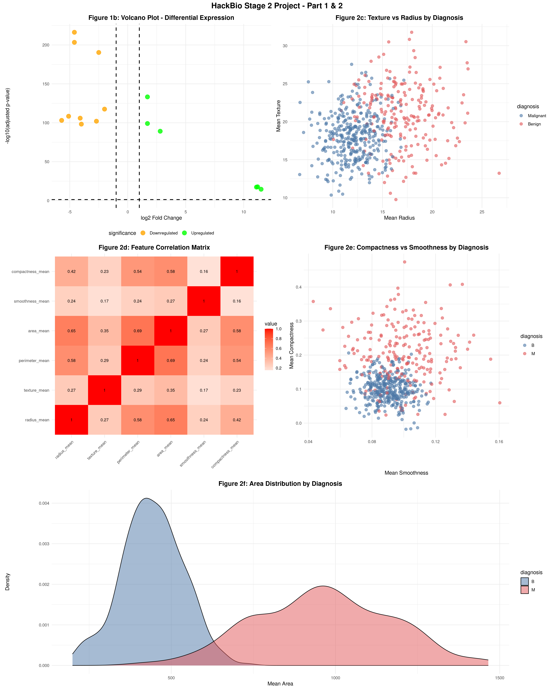
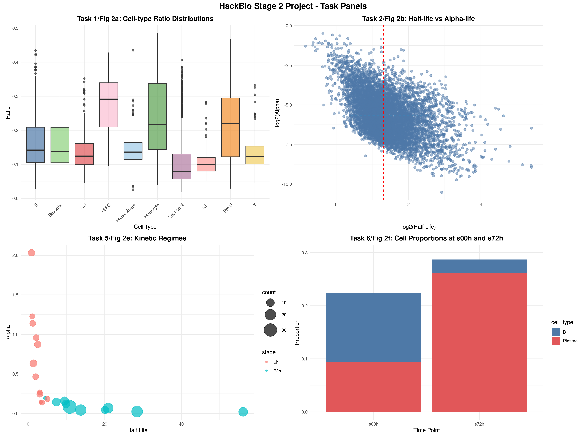

# HackBio Internship - Stage 2 Project

## Gene Expression and Breast Cancer Data Analysis

**Name:** GRACE ADELOYE
**Date:** February 17, 2026

## Project Overview
This project analyzes gene expression data (HBR vs UHR samples) and breast cancer diagnostic features using R. It includes heatmaps, volcano plots, scatter plots, correlation matrices, density plots, and network analysis.

## Results

### Part 1: Gene Expression Analysis

#### Figure 1a: Heatmap - HBR vs UHR

*Clustered heatmap showing expression patterns of genes between HBR and UHR samples*

#### Figure 1b: Volcano Plot

*Volcano plot displaying log2 fold change vs -log10(adjusted p-value)*

### Part 2: Breast Cancer Data Exploration

#### Figure 2c: Texture vs Radius

*Scatter plot showing relationship between texture and radius, colored by diagnosis*

#### Figure 2d: Feature Correlation Matrix

*Correlation matrix of six key features with annotated values*

#### Figure 2e: Smoothness vs Compactness

*Relationship between smoothness and compactness by diagnosis*

#### Figure 2f: Area Distribution

*Density plot showing distribution of area values for malignant and benign diagnoses*

### Part 3: Additional Analyses (Tasks 1-7)

#### Task 1/Fig 2a: Cell-type Ratio Distributions

*Boxplot showing distribution of ratios across immune cell types*

#### Task 2/Fig 2b: Half-life vs Alpha-life

*Scatter plot of log2(half_life) vs log2(alpha)*

#### Task 3/Fig 2c: Expression Heatmap

*Heatmap showing gene expression across cell types and time points*

#### Task 5/Fig 2e: Kinetic Regimes Bubble Plot

*Bubble plot showing half-life vs alpha, with size representing count*

#### Task 6/Fig 2f: Stacked Proportions

*Stacked bar plot showing cell proportions at s00h and s72h*

#### Task 7/Fig 2g: Cell-Cell Interaction Network

*Directed network graph showing cell-cell interactions*

### Final Assembled Figures

#### Part 1 & 2 Combined

*Combined figure showing Part 1 and Part 2 results*

#### Tasks Combined

*Combined figure showing Task panels*

## Conceptual Explanations

### Why log2 transformation?
- Makes multiplicative relationships additive
- Stabilizes variance across the range
- Makes data more normally distributed
- Log2 units are intuitive (doubling = +1, halving = -1)

### Four quadrants interpretation in Task 2b
- **Q1 (High/High)**: Long half-life, high processing rate - Stable but rapidly processed
- **Q2 (Low/High)**: Short half-life, high processing rate - Unstable but efficiently processed
- **Q3 (Low/Low)**: Short half-life, low processing rate - Unstable and slowly processed
- **Q4 (High/Low)**: Long half-life, low processing rate - Stable but slowly processed

### Why cluster genes but not time? (Task 3)
Genes are clustered to identify co-expression patterns and functional groups, while time points are kept in order to preserve temporal progression and biological interpretation.

### Why no clustering in pathway heatmap? (Task 4)
Pathways often have inherent biological organization that should be preserved. Clustering might disrupt known biological relationships.

### Why a diverging palette? (Task 4)
Diverging color scales (blue-white-red) show both positive and negative enrichment from a meaningful midpoint (zero), making directional changes immediately visible.

### Why stacked instead of side-by-side bars? (Task 6)
Stacked bars show both absolute and relative proportions simultaneously, making it easy to see how total composition changes over time.

### Why directed network? (Task 7)
Cell-cell interactions are inherently directional - signaling flows from one cell to another. Directed edges capture the biological reality of communication.

### Edge weight biological meaning (Task 7)
Edge weight represents interaction strength between cell types. Higher weights indicate stronger signaling, more frequent communication, or higher probability of interaction.

## Code Availability
The complete R code used for this analysis is available upon request.
